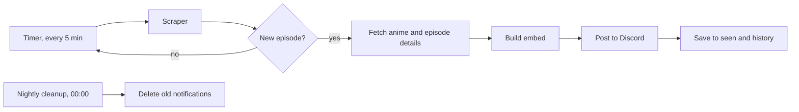

# LeoSubs News Bot


[English](#english) · [Türkçe](#türkçe)

> The source code of this project is private. This repository only documents it.
> Bu projenin kaynak kodu özeldir. Bu repo sadece projeyi anlatır.

---

## English

A Discord bot that keeps an eye on [leosubs.co](https://leosubs.co) and posts in a channel when a new episode comes out. It exists so nobody has to keep refreshing the site.

### How it works



Every 5 minutes the bot reads the site's latest episodes list. Each episode gets an ID built from the anime, season and episode number, and the bot checks it against what it has already seen. Anything new is handled from oldest to newest, so the channel stays in order.

For each new episode the bot opens the anime page and the episode page and collects the cover image, year, score, studio, genres, synopsis, episode title, translator and editor. All of it goes into one embed. A role can be pinged if one is configured.

Translators and editors are matched against `credits.json`. If a name has a Discord ID there, the person is mentioned. If not, the name is written as plain text. If the site has no name, that field is left out.

When an episode is the last one of a season, the embed description is different. The total episode counts come from `season-final-episode.json`, which is maintained by hand.

On the very first run the bot only memorizes the episodes that are already on the site and posts nothing, so a fresh install never spams the channel.

If the site fails to respond three checks in a row, the bot sends a DM to its owner.

Every night at 00:00 a cleanup job deletes notification messages older than a set number of days. The record of the episode stays in the history file, marked as deleted.

### Data files

The bot has no database. Everything is stored in small JSON files.

| File | What it holds |
| --- | --- |
| `seen.json` | Episodes the bot has already announced |
| `history.json` | Past notifications, used by the cleanup job |
| `status.json` | Health of the bot and the last check results |
| `credits.json` | Translator and editor names mapped to Discord IDs |
| `season-final-episode.json` | Total episode count per anime |

We tried SQLite at one point and went back to JSON. For this size of data it added more work than it saved. If `credits.json` is missing, the bot creates an empty one and keeps running.

### Tech stack

| Tool | Used for |
| --- | --- |
| Node.js | Runtime |
| discord.js | Discord connection, commands, embeds |
| @discordjs/voice | Staying in a fixed voice channel |
| axios | HTTP requests |
| cheerio | Reading the HTML |
| node-cron | Scheduled jobs (nightly cleanup) |
| dotenv | Config and secrets |
| pm2 | Keeps the bot running and restarts it after a reboot |

It runs on an Ubuntu VDS under pm2.

### Project layout

```
bot.js              Starts the bot
deploy-commands.js  Registers slash commands with Discord
commands/           One file per command
events/             ready, interactionCreate
services/           scraper, notifier, messageCleanup
data/               storage, status, history and the JSON files
```

The scraping lives in a single function. If the site changes, or a real browser is ever needed, only that part has to be rewritten.

### Commands

| Command | Description |
| --- | --- |
| `/ping` | Shows if the bot is up and its latency |
| `/embed-olustur` | Opens a form (title, description, color, image, footer) and posts a custom embed. Admin only |
| `/voice-baglan` | Joins the fixed voice channel. Admin only |
| `/voice-ayril` | Leaves the voice channel. Admin only |
| `/leo` | Lists the available commands |
| `/takvim` | Shows the weekly release schedule, updated by hand each season |

### Notes

The bot only reads the public latest-episodes page of leosubs.co. It does not copy or republish any content. It just carries the "new episode" information to Discord.

The bot is not public and has no invite link.

### Contact

- Website: [leosubs.co](https://leosubs.co)
- Discord: `wzlm`

### License

See [LICENSE.md](LICENSE.md).

---

## Türkçe

[leosubs.co](https://leosubs.co)'yu takip edip yeni bir bölüm çıktığında kanala haber veren bir Discord botu. Amacı, sayfayı sürekli yenilemek zorunda kalmamak.

### Nasıl çalışıyor

Yukarıdaki şema burada da geçerli.

Bot 5 dakikada bir sitenin son bölümler listesini okuyor. Her bölüme anime, sezon ve bölüm numarasından bir kimlik çıkarıp daha önce gördükleriyle karşılaştırıyor. Yeni çıkanlar eskiden yeniye doğru işleniyor, böylece kanalda sıra bozulmuyor.

Her yeni bölüm için anime sayfasını ve bölüm sayfasını açıp kapak resmi, yıl, puan, stüdyo, türler, konu, bölüm adı, çevirmen ve redaktör bilgilerini topluyor ve hepsini tek bir embed'e koyuyor. İstenirse belirli bir rol de etiketleniyor.

Çevirmen ve redaktör isimleri `credits.json` ile eşleştiriliyor. Orada Discord ID'si olan kişi etiketleniyor, olmayanın ismi düz yazı olarak görünüyor. Sitede isim yoksa o alan hiç gösterilmiyor.

Bir bölüm sezonun son bölümüyse embed açıklaması farklı yazılıyor. Toplam bölüm sayıları elle tutulan `season-final-episode.json` dosyasından geliyor.

Bot ilk açıldığında sitedeki mevcut bölümleri sadece hafızaya alıyor, kanala hiçbir şey atmıyor. Yani yeni kurulumda kanal mesajla dolmuyor.

Site üst üste üç kontrolde cevap vermezse bot sahibine DM atıyor.

Her gece 00:00'da bir temizlik görevi çalışıp belirlenen günden eski bildirim mesajlarını siliyor. Bölümün kaydı geçmiş dosyasında "silindi" işaretiyle duruyor.

### Veri dosyaları

Botta veritabanı yok, her şey küçük JSON dosyalarında tutuluyor.

| Dosya | İçeriği |
| --- | --- |
| `seen.json` | Botun daha önce bildirdiği bölümler |
| `history.json` | Geçmiş bildirimler, temizlik görevi bunu kullanıyor |
| `status.json` | Botun sağlık durumu ve son kontrol sonuçları |
| `credits.json` | Çevirmen/redaktör isimleri ve Discord ID eşleşmeleri |
| `season-final-episode.json` | Animelerin toplam bölüm sayıları |

Bir ara SQLite denedik, sonra JSON'a geri döndük. Bu kadar küçük veri için getirdiği iş kazandırdığından fazlaydı. `credits.json` yoksa bot boş bir tane oluşturuyor ve çalışmaya devam ediyor.

### Kullanılan teknolojiler

| Araç | Ne için |
| --- | --- |
| Node.js | Çalışma ortamı |
| discord.js | Discord bağlantısı, komutlar, embed'ler |
| @discordjs/voice | Sabit bir ses kanalında durmak |
| axios | HTTP istekleri |
| cheerio | HTML okuma |
| node-cron | Zamanlanmış görevler (gece temizliği) |
| dotenv | Ayarlar ve gizli bilgiler |
| pm2 | Botu açık tutmak, yeniden başlatmada ayağa kaldırmak |

Bot, Ubuntu bir VDS üzerinde pm2 ile çalışıyor.

### Proje yapısı

```
bot.js              Botu başlatır
deploy-commands.js  Slash komutlarını Discord'a tanıtır
commands/           Her komutun kendi dosyası
events/             ready, interactionCreate
services/           scraper, notifier, messageCleanup
data/               storage, status, history ve JSON dosyaları
```

Site okuma işi tek bir fonksiyonda duruyor. Site değişirse ya da bir gün gerçek tarayıcı gerekirse sadece orası yeniden yazılacak.

### Komutlar

| Komut | Açıklama |
| --- | --- |
| `/ping` | Botun açık olup olmadığını ve gecikmesini gösterir |
| `/embed-olustur` | Form açar (başlık, açıklama, renk, resim, footer) ve istenen embed'i gönderir. Sadece yönetici |
| `/voice-baglan` | Botu sabit ses kanalına sokar. Sadece yönetici |
| `/voice-ayril` | Botu ses kanalından çıkarır. Sadece yönetici |
| `/leo` | Kullanılabilir komutları listeler |
| `/takvim` | Haftalık yayın takvimini gösterir, her sezon elle güncellenir |

### Notlar

Bot sadece leosubs.co'nun herkese açık son bölümler sayfasını okuyor. Hiçbir içeriği kopyalamıyor ya da yeniden yayınlamıyor, sadece "yeni bölüm çıktı" bilgisini Discord'a taşıyor.

Bot herkese açık değil, davet linki yok.

### İletişim

- Site: [leosubs.co](https://leosubs.co)
- Discord: `wzlm`

### Lisans

[LICENSE.md](LICENSE.md) dosyasına bak.