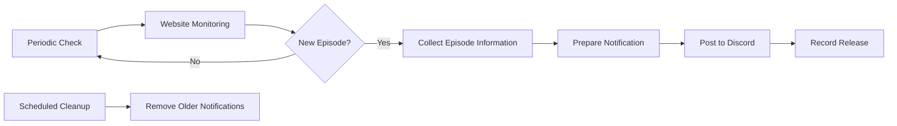
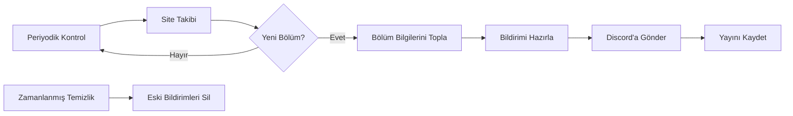

# LeoSubs Bot

[English](#english) · [Türkçe](#türkçe)

> The source code of this project is private. This repository only documents it.
> Bu projenin kaynak kodu özeldir. Bu repo sadece projeyi anlatır.

---

## English

LeoSubs Bot is a private Discord bot designed to monitor [leosubs.co](https://leosubs.co) and notify a Discord channel when new anime episodes are published.

Its purpose is to provide a simple way for a community to keep track of new releases without having to manually check the website.

### How It Works

The general workflow can be summarized as follows:

The bot periodically checks the website for newly published episodes.

When a new release is detected, relevant information about the anime and episode is collected and presented in a Discord notification.

The notification can include information such as the anime, episode, cover image, production details, and members involved in the release.

The system can also notify specific Discord roles or users when appropriate.

Previously announced episodes are not announced again, allowing the bot to keep the notification channel organized.

### First Run

When the bot is started for the first time, existing releases are recognized without being posted as new notifications.

This prevents a newly configured installation from filling the Discord channel with older releases.

### Release History

The system keeps a record of previously processed releases.

This allows the bot to distinguish between new and previously handled episodes and maintain a history of past notifications.

### Notifications

Release information is presented through Discord embeds.

Depending on the available information, notifications may contain details such as:

* Anime information
* Episode information
* Cover artwork
* Production details
* Translation and editing credits
* Additional release information

The information shown can vary depending on what is available on the website.

### Scheduled Maintenance

The bot performs scheduled maintenance to keep the notification channel clean.

Older notification messages can be removed after a defined period while their release records remain preserved in the system's history.

### Availability Monitoring

The bot can monitor the availability of the website.

If the monitored source remains unavailable for an extended period, the system can notify the bot owner so that the issue can be investigated.

### Discord Features

In addition to automatic release notifications, the bot provides several Discord-based utilities for administrators and server members.

These include basic bot status information, release schedule information, custom embed creation, and voice-channel related controls.

### Tech Stack

The project is built around a Node.js-based Discord bot architecture and uses several supporting technologies for Discord communication, website monitoring, scheduled tasks, configuration, and process management.

The bot currently runs on a private Ubuntu VDS environment.

### Notes

The bot only monitors publicly available release information from [leosubs.co](https://leosubs.co).

It does not provide an invite link and is not distributed as a public Discord bot.

### Privacy

The source code and internal implementation of the project are private.

This repository only documents the general purpose and user-visible behavior of the bot. Internal implementation details, data structures, and deployment information are intentionally not documented here.

### Contact

* Website: [leosubs.co](https://leosubs.co)
* Discord Server: [Server](https://discord.gg/8HKuCMYFMr)
* Discord: `wzlm`

### License

See [LICENSE.md](LICENSE.md).

---

## Türkçe

LeoSubs News Bot, [leosubs.co](https://leosubs.co) sitesini takip ederek yeni anime bölümleri yayınlandığında Discord üzerinden bildirim göndermek amacıyla geliştirilmiş özel bir Discord botudur.

Amacı, yeni bölümleri takip eden kişilerin siteyi sürekli kontrol etmek zorunda kalmadan yeni yayınlardan haberdar olmasını sağlamaktır.

### Nasıl Çalışıyor

Genel çalışma mantığı şu şekilde özetlenebilir:

Bot belirli aralıklarla siteyi kontrol ederek yeni yayınlanan bölümleri takip eder.

Yeni bir bölüm tespit edildiğinde anime ve bölüm hakkında mevcut bilgiler alınır ve Discord üzerinde düzenli bir bildirim oluşturulur.

Bildirimlerde anime, bölüm, kapak görseli, yapım bilgileri ve yayında görev alan kişiler gibi bilgiler bulunabilir.

Gerektiğinde belirli Discord rolleri veya kullanıcıları da bildirim içerisinde etiketlenebilir.

Daha önce bildirilmiş bölümler tekrar bildirilmez. Böylece bildirim kanalı gereksiz tekrarlarla doldurulmaz.

### İlk Çalıştırma

Bot ilk kez çalıştırıldığında sitede zaten bulunan eski yayınları yeni bölüm olarak paylaşmaz.

Böylece yeni kurulan bir sistemin mevcut bölümleri arka arkaya Discord kanalına göndermesi engellenir.

### Yayın Geçmişi

Sistem daha önce işlenen yayınların kaydını tutar.

Bu kayıtlar sayesinde yeni bölümler ile daha önce işlenmiş bölümler birbirinden ayırt edilir ve geçmiş yayınlar takip edilebilir.

### Bildirimler

Yeni yayınlar Discord embedleri aracılığıyla gösterilir.

Mevcut bilgilere bağlı olarak bildirimlerde:

* Anime bilgileri
* Bölüm bilgileri
* Kapak görseli
* Yapım bilgileri
* Çeviri ve redakte bilgileri
* Diğer yayın bilgileri

yer alabilir.

Gösterilen bilgiler, ilgili yayında sitede bulunan verilere göre değişebilir.

### Zamanlanmış Bakım

Bot, bildirim kanalının düzenli kalması için belirli zamanlarda bakım işlemleri gerçekleştirir.

Belirli bir süreden eski bildirimler kanaldan kaldırılabilir. Ancak ilgili yayın kayıtları sistem içerisindeki geçmişte korunur.

### Site Durumu Takibi

Bot, takip edilen sitenin erişilebilirliğini de kontrol edebilir.

Kaynak uzun süre boyunca kullanılamaz durumda olduğunda bot sahibi bilgilendirilebilir. Böylece oluşabilecek sorunlar daha hızlı fark edilebilir.

### Discord Özellikleri

Otomatik yayın bildirimlerinin yanında bot, Discord içerisinde çeşitli yardımcı özellikler de sunar.

Bunlar arasında temel bot durum bilgileri, yayın takvimi, özel embed oluşturma ve ses kanalıyla ilgili yönetim özellikleri bulunur.

### Kullanılan Teknolojiler

Proje, Node.js tabanlı bir Discord bot yapısı üzerine kuruludur ve Discord iletişimi, site takibi, zamanlanmış işlemler, yapılandırma ve süreç yönetimi için çeşitli teknolojilerden yararlanır.

Bot şu anda özel bir Ubuntu VDS ortamında çalışmaktadır.

### Notlar

Bot yalnızca [leosubs.co](https://leosubs.co) üzerinde herkese açık olarak bulunan yayın bilgilerini takip eder.

Herhangi bir içerik dağıtımı gerçekleştirmez ve herkese açık bir Discord davet bağlantısı bulunmaz.

### Gizlilik

Projenin kaynak kodu ve dahili çalışma yapısı özeldir.

Bu repository yalnızca botun genel amacını ve kullanıcı tarafından görülebilen çalışma şeklini açıklar. Dahili uygulama ayrıntıları, veri yapıları ve kurulum/deployment bilgileri özellikle dokümantasyon dışında tutulmuştur.

### İletişim

* Site: [leosubs.co](https://leosubs.co)
* Discord Sunucusu: [Sunucu](https://discord.gg/8HKuCMYFMr)
* Discord: `wzlm`

### Lisans

[LICENSE.md](LICENSE.md) dosyasına bakınız.